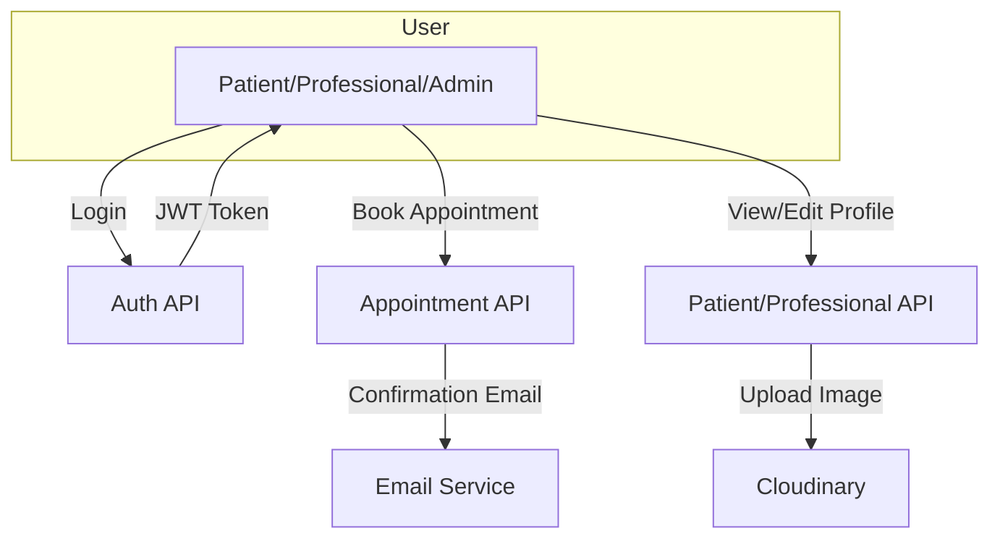
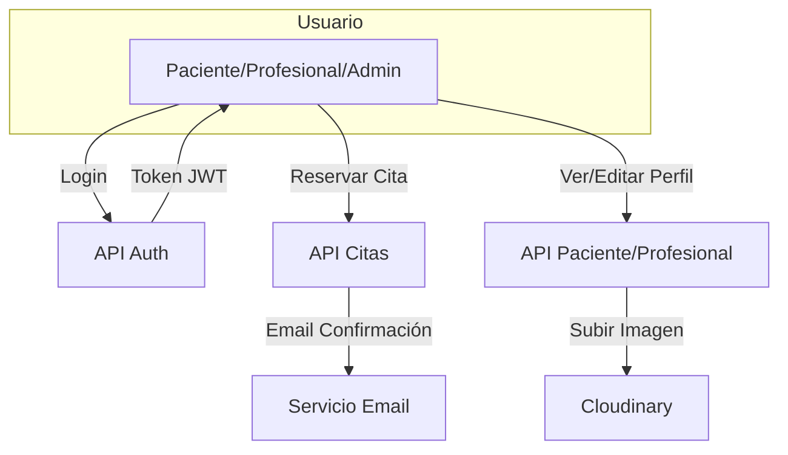

# IronHealth Backend

## English

### Project Overview
IronHealth is a collaborative backend project developed by a team of full-stack developer students and a project lead professor. It provides a robust API for managing healthcare appointments, patients, professionals, and user authentication, with a focus on security, scalability, and real-world workflows.

---

## Table of Contents
- [Installation](#installation)
- [Tech Stack](#tech-stack)
- [Repository Structure](#repository-structure)
- [App Architecture](#app-architecture)
- [Workflows](#workflows)
- [Main Features](#main-features)
- [Collaborative Project](#collaborative-project)

---

## Installation

1. **Clone the repository:**
   ```bash
   git clone <repo-url>
   cd backend-ironhealth
   ```
2. **Install dependencies:**
   ```bash
   npm install
   ```
3. **Set up environment variables:**
   - Copy `.env.example` to `.env` and fill in the required values (MongoDB URI, JWT secret, Cloudinary, Resend, etc).
4. **Run the app:**
   - Development: `npm run dev`
   - Production: `npm start`
5. **Run tests:**
   ```bash
   npm test
   ```

---

## Tech Stack
- **Node.js** (Express.js)
- **MongoDB** (Mongoose)
- **JWT** authentication
- **Cloudinary** (image uploads)
- **Resend** (email service)
- **Jest** & **Supertest** (testing)
- **Prettier** & **ESLint** (code style)

---

## Repository Structure
```
backend-ironhealth/
├── app.js                  # Main Express app
├── package.json            # Project config & scripts
├── jest.config.cjs         # Jest test config
├── waitlist.txt            # Waitlist emails
├── api/
│   ├── config/             # DB & cloud config
│   ├── controllers/        # Route controllers (business logic)
│   ├── data/               # Static data (professions)
│   ├── middlewares/        # Express middlewares
│   ├── models/             # Mongoose models
│   ├── routes/             # Express routes
│   ├── seeds/              # DB seed scripts
│   ├── services/           # Email & other services
│   ├── utils/              # Utility functions
│   ├── validators/         # Input validation
├── __tests__/              # Automated tests
│   ├── helpers/            # Test helpers
│   ├── routes/             # Route tests
├── scripts/                # Utility scripts (e.g., testEmail.mjs)
```

---

## App Architecture
- **MVC-inspired**: Controllers handle business logic, models define data, routes expose endpoints.
- **Authentication**: JWT-based, with role-based access (admin, professional, patient).
- **Validation**: All input is validated and sanitized.
- **Email**: Templated transactional emails (welcome, appointment confirmation) via Resend.
- **Image Uploads**: Cloudinary integration for patient/professional images.
- **Testing**: In-memory MongoDB for fast, isolated tests.

---

## Workflows



---

## Main Features
- Secure authentication (JWT, role-based)
- Patient, professional, and admin user management
- Appointment booking, editing, cancellation
- Email notifications (welcome, appointment confirmation)
- Professional specialties and validation
- Cloud image uploads
- Comprehensive test suite
- Input validation and error handling

---

## Collaborative Project
This project was developed collaboratively by a team full-stack developer students and a project lead professor as part of an advanced bootcamp. All code, features, and documentation reflect teamwork, code reviews, and real-world agile practices.

---

# Español

## Descripción del Proyecto
IronHealth es un backend colaborativo desarrollado por un equipo de alumnos desarrolladores full-stack y un profesor (project lead). Proporciona una API robusta para la gestión de citas médicas, pacientes, profesionales y autenticación de usuarios, con enfoque en seguridad, escalabilidad y flujos de trabajo reales.

---

## Tabla de Contenidos
- [Instalación](#instalación)
- [Stack Tecnológico](#stack-tecnológico)
- [Estructura del Repositorio](#estructura-del-repositorio)
- [Arquitectura de la App](#arquitectura-de-la-app)
- [Workflows](#workflows-1)
- [Funcionalidades Principales](#funcionalidades-principales)
- [Proyecto Colaborativo](#proyecto-colaborativo)

---

## Instalación
1. **Clona el repositorio:**
   ```bash
   git clone <repo-url>
   cd backend-ironhealth
   ```
2. **Instala las dependencias:**
   ```bash
   npm install
   ```
3. **Configura las variables de entorno:**
   - Copia `.env.example` a `.env` y rellena los valores necesarios (MongoDB URI, JWT secret, Cloudinary, Resend, etc).
4. **Ejecuta la app:**
   - Desarrollo: `npm run dev`
   - Producción: `npm start`
5. **Ejecuta los tests:**
   ```bash
   npm test
   ```

---

## Stack Tecnológico
- **Node.js** (Express.js)
- **MongoDB** (Mongoose)
- **JWT** autenticación
- **Cloudinary** (subida de imágenes)
- **Resend** (servicio de emails)
- **Jest** & **Supertest** (testing)
- **Prettier** & **ESLint** (estilo de código)

---

## Estructura del Repositorio
```
backend-ironhealth/
├── app.js                  # App principal Express
├── package.json            # Configuración y scripts
├── jest.config.cjs         # Configuración de tests
├── waitlist.txt            # Correos en lista de espera
├── api/
│   ├── config/             # Configuración DB y cloud
│   ├── controllers/        # Lógica de negocio
│   ├── data/               # Datos estáticos (profesiones)
│   ├── middlewares/        # Middlewares Express
│   ├── models/             # Modelos Mongoose
│   ├── routes/             # Rutas Express
│   ├── seeds/              # Scripts de seed
│   ├── services/           # Servicios (email, etc)
│   ├── utils/              # Utilidades
│   ├── validators/         # Validación de datos
├── __tests__/              # Tests automáticos
│   ├── helpers/            # Helpers de test
│   ├── routes/             # Tests de rutas
├── scripts/                # Scripts utilitarios
```

---

## Arquitectura de la App
- **Inspirada en MVC**: Controladores gestionan la lógica, modelos definen datos, rutas exponen endpoints.
- **Autenticación**: Basada en JWT, con roles (admin, profesional, paciente).
- **Validación**: Todos los inputs son validados y saneados.
- **Email**: Emails transaccionales con plantillas (bienvenida, confirmación de cita) vía Resend.
- **Subida de Imágenes**: Integración con Cloudinary.
- **Testing**: MongoDB en memoria para tests rápidos y aislados.

---

## Workflows



---

## Funcionalidades Principales
- Autenticación segura (JWT, roles)
- Gestión de usuarios: pacientes, profesionales, admin
- Reservas, edición y cancelación de citas
- Notificaciones por email (bienvenida, confirmación de cita)
- Validación de especialidades profesionales
- Subida de imágenes a la nube
- Test suite completa
- Validación y manejo de errores

---

## Proyecto Colaborativo
Este proyecto fue desarrollado de forma colaborativa por un equipo de alumnos desarrolladores full-stack y un profesor (project lead) como parte de un bootcamp avanzado. Todo el código, funcionalidades y documentación reflejan trabajo en equipo, code reviews y prácticas ágiles reales.

---
